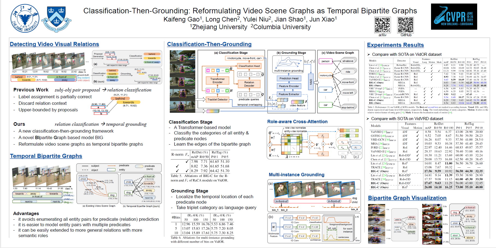

# Classification-Then-Grounding: Reformulating Video Scene Graphs as Temporal Bipartite Graphs

Pytorch implementation of our paper [**Classification-Then-Grounding: Reformulating Video Scene Graphs as Temporal Bipartite Graphs**](https://openaccess.thecvf.com/content/CVPR2022/html/Gao_Classification-Then-Grounding_Reformulating_Video_Scene_Graphs_As_Temporal_Bipartite_Graphs_CVPR_2022_paper.html), which is accepted by CVPR2022. [(arXiv)](https://arxiv.org/abs/2112.04222)




We also won the 1st place of Video Relation Understanding (VRU) Grand Challenge in ACM Multimedia 2021, with a simplified version of our model.(The code for object tracklets generation is available at [here](https://github.com/Dawn-LX/VidVRD-tracklets))

# Requirements
Python == 3.7 or later, Pytorch == 1.6 or later, for other basic packages, just run the project and download whatever needed.

# Datasets
Download the [ImageNet-VidVRD](https://xdshang.github.io/docs/imagenet-vidvrd.html) dataset and [VidOR](https://xdshang.github.io/docs/vidor.html) dataset, and put them in the following folder as

```
├── dataloaders
│   ├── dataloader_vidvrd.py
│   └── ...
├── datasets
│   ├── cache                       # cache file for our dataloaders
│   ├── vidvrd-dataset
│   │   ├── train
│   │   ├── test
│   │   └── videos
│   ├── vidor-dataset
│   │   ├── annotation
│   │   └── videos
│   └── GT_json_for_eval
│       ├── VidORval_gts.json       # GT josn for evlauate
│       └── VidVRDtest_gts.json
├── tracking_results                # tracklets data & features
│   ├── ...
│   ├── format_demo.py              
│   └── readme.md   
├── experiments   
├── models
├── ...

```

# Verify tracklets data & feature preparation by running dataloader_demo
This section helps you download the tracklets data and place them correctly, as well as set the dataloader's config correctly. Successfully run the `tools/dataloader_demo.py` to verify all data & configs are set correctly.

**NOTE** we use the term `proposal` in our code to represent tracklet proposals in video-level, which is totally different with the concept of "proposal" in "proposal-based methods" in our paper. In our paper, we use "proposals to represent paired subject-object tracklet segments. In contrast, here the term `proposal` in our code represents long-term object tracklets in video-level (i.e., without sliding window or video segments).

## Tracklet data for VidVRD 
1. Download the tracklet with features at here:  [train](https://mega.nz/folder/1QA31RaK#pEP60O-ENr-5k_9ByoJhag), [test](https://pan.zju.edu.cn/share/694f908a22fff11c037eb50876). And put them in `tracking_results/`. Refer to `tracking_results/readme.md` for more details about the tracklet data.

2. Download the tracklet with features used in ["Beyond Short-Term Snippet: Video Relation Detection with Spatio-Temporal Global Context"](https://pkumyd.github.io/paper/CVPR2020_VideoVRD.pdf) at the author's personal page [here](http://www.muyadong.com/publication.html).

    **Some Notes** 
    - we use the term `pku` (i.e., Peking University) in our code to refer to their tracklets & features)
    - The original data released by them only have 999 `.npy` files (maybe they have updated the link now), missing data for video `ILSVRC2015_train_00884000`. So we trained our own Faster-RCNN (same training setting as the above paper), and extract the tracklet & features. And the supplemental data can be find [here](https://mega.nz/folder/FMhzFD4A#7R2c98TxgA7Av_b9-_ijYg).
    

3. The tracklet with features are in `VidVRD_test_every1frames` (ours), `VidVRD_train_every1frames` (ours), `preprocess_data/tracking/videovrd_detect_tracking` (PKU, both train & test), in whcih each `.npy` file corresponds to a video and contains all the tracklets in that video. The I3D features of tracklets are in `preprocess_data/tracking/videovrd_i3d` (PKU, both train & test).
Put them under the dir of this project (or any other position if you use absolute path).

4. modify the config file at `experiments/demo/config_.py`, where `proposal_dir` is the dir of tracklet with features, `i3d_dir` is the dir of tracklets' I3D features, and `ann_dir` is `datasets/vidvrd-dataset`.

5. Verify all data & configs are set correctly. e.g., for PKU's tracklets with I3D features, run the following commands: (refer to `tools/dataloader_demo.py` for more details.):
    ```
    python tools/dataloader_demo.py \
            --cfg_path experiments/demo/config_.py \
            --split test \
            --dataset_class pku_i3d
    ```

## Tracklet data for VidOR 

- Download the I3D feature of train & val videos (used for grounding stage) at [here](https://mega.nz/folder/FAxh0CiC#2zLOovjX8epdgMq5rXwEhg)
- Download the pre-prepared cache data for VidOR-val ([here](https://mega.nz/folder/VcwA1DaI#YW2M_uFsbsE6twHDIpfPuw), around 19G), VidOR-train ([here](https://mega.nz/folder/8IBzkKQS#6TXQWikT4HL5LoCnQrpsJA), 14 parts in total, around 126G), and put them in `datasets/cache`. (these cached data includes classeme features)
- **Some Notes** 

    Ideally, you can prepare these cache data from `.npy` files (as did in VidVRD). However, due to some ancient coding reasons, we extract bbox RoI feature for each frame, which makes these `.npy` files too large (**827G** for VidOR-train and **90G** for VidOR-val). Therefore, we only release pre-prepared cache data as above.
    
    Despite this, we still release the `.npy` files without RoI features, i.e., only box positions, ([here](https://drive.google.com/drive/folders/1wWkzHlhYcZPQR4fUMTTJEn2SVVnhGFch?usp=sharing), around 12G), and you can extract their RoI features based on the position by yourself. Refer to `tracking_results/readme.md` for more details about the tracklet data.

    Refer to this repository [VidVRD-tracklets](https://github.com/Dawn-LX/VidVRD-tracklets) (last Section of README.md) for more details about extracting features based on the given bbox positions.

    As for classeme feature, For VidOR, we use the weighted average of category word embeddings, based on the classification probability vectors predicted by the detector. ("soft" classeme)  For VidVRD, we just use the  category word embeddings as classeme feature, i.e., "hard" classeme. refer to `tools_draft/extract_classeme.py` for more details.

# Evaluation: 
**First, make sure you run `tools/dataloader_demo.py` successfully**

1. first generate the GT json file for evaluation:
    
    for vidvrd:
    ```
    python VidVRD-helper/prepare_gts_for_eval.py \
        --dataset_type vidvrd \
        --save_path datasets/GT_json_for_eval/VidVRDtest_gts.json
    ```
    for vidor:
    ```
    python VidVRD-helper/prepare_gts_for_eval.py \
        --dataset_type vidor \
        --save_path datasets/GT_json_for_eval/VidORval_gts.json
    ```
2. Download model weights for different exps [here](https://drive.google.com/file/d/1vE-cQrNUrpSKrWC94orbbpVLkvuDKFwm/view?usp=sharing), and put them in the `experiments/` dir. Download pre-prepared data [here](https://mega.nz/folder/tY5HQQwK#9Mgw4usgxF5FEI4RZArfmw), and put them in the `prepared_data/` dir.
3. Refer to `experiments/readme.md` for the correspondence between the exp ids and the table ids in our paper.
4. For **VidVRD**, run the following commands to evaluate different exps: (refer to `tools/eval_vidvrd.py` for more details)

    e.g., for exp1
    ```
    python tools/eval_vidvrd.py \
        --cfg_path experiments/exp1/config_.py \
        --ckpt_path experiments/exp1/model_epoch_80.pth \
        --use_pku \
        --cuda 1 \
        --save_tag debug
    ```
5. For **VidOR**, refer to `tools/eval_vidor.py` for more details. 

    Run the following commands to evaluate BIG-C (i.e., only the classification stage):
    ```
    python tools/eval_vidor.py \
        --eval_cls_only \
        --cfg_path experiments/exp4/config_.py \
        --ckpt_path experiments/exp4/model_epoch_60.pth \
        --save_tag epoch60_debug \
        --cuda 1
    ```
    Run the following commands to evaluate BIG based on the output of cls stage (you need run BIG-C first and save the `infer_results`).
    ```
    python tools/eval_vidor.py \
        --cfg_path experiments/grounding_weights/config_.py \
        --ckpt_path experiments/grounding_weights/model_epoch_70.pth \
        --output_dir experiments/exp4_with_grounding \
        --cls_stage_result_path experiments/exp4/VidORval_infer_results_topk3_epoch60_debug.pkl \
        --save_tag with_grd_epoch70 \
        --cuda 1
    ```
    Run the following commands to evaluate the fraction recall (refer to table-6 in our paper, you need run BIG first and save the `hit_infos`).
    ```
    python tools/eval_fraction_recall.py \
        --cfg_path experiments/grounding_weights/config_.py \
        --hit_info_path  experiments/exp5_with_grounding/VidORval_hit_infos_aft_grd_with_grd_epoch70.pkl
    ```

**NOTE** 
- We also provide another evaluation scripts (i.e., `tools/eval_vidvrd_our_gt.py` and `tools/eval_vidor_our_gt.py`). The main difference lies in the process of constructing GT tracklets (i.e., from frame-level bbox annotations to video-level tracklets GTs). Compared to VidVRD-helper's GTs, here we perform linear interpolation for fragmented GT tracklets. Consequently the evaluation results have slight differences.
- Nevertheless, the results reported in our paper are evaluated with VidVRD-helper's GTs (i.e., `tools/eval_vidvrd.py` and `tools/eval_vidor.py`) to ensure fair comparisons.
- In our paper, all scores are truncated to 4 decimal places (not rounded)
    
# Training

1. For **VidVRD**, run the following commands to train for different exps: (refer to `tools/train_vidvrd.py` for more details)

    e.g., for exp1
    ```
    CUDA_VISIBLE_DEVICES=0,1 python tools/train_vidvrd.py \
        --cfg_path experiments/exp1/config_.py \
        --use_pku \
        --save_tag retrain
    ```

2. For **VidOR**, refer to `tools/train_vidor.py.py` for more details

    Run the following commands to train BIG-C (i.e., only the classification stage). e.g., for exp4
    ```
    CUDA_VISIBLE_DEVICES=0,1 python tools/train_vidor.py \
        --cfg_path experiments/exp4/config_.py \
        --save_tag retrain
    ```

    Note that we pre-assign all the labels for Base-C (exp6) since it does not require bipartite matching between predicate and GTs. The label assignment takes around **1.5 hours**.

    Run the following commands to train the grounding stage:
    ```
    CUDA_VISIBLE_DEVICES=2,3 python tools/train_vidor.py \
        --train_grounding \
        --cfg_path experiments/grounding_weights/config_.py \
        --save_tag retrain
    ```

# Data Release Summarize 

- model weights for all exps (**Done**, dcd google drive, [here](https://drive.google.com/file/d/1vE-cQrNUrpSKrWC94orbbpVLkvuDKFwm/view?usp=sharing))
- pre-prepared data (statical prior & category text Glove embddings) (dcd MEGA cloud, [here](https://mega.nz/folder/tY5HQQwK#9Mgw4usgxF5FEI4RZArfmw))
- I3D feature of VidOR train & val around 3.3G (**Done**, dcd MEGA cloud, [here](https://mega.nz/folder/FAxh0CiC#2zLOovjX8epdgMq5rXwEhg))
- VidOR traj `.npy` files (OnlyPos) (this has been released, around 12G) **Done** [here](https://drive.google.com/drive/folders/1wWkzHlhYcZPQR4fUMTTJEn2SVVnhGFch?usp=sharing) (jypcxlx google drive).refer to this repository: [VidVRD-tracklets](https://github.com/Dawn-LX/VidVRD-tracklets)
- VidVRD traj `.npy` files (with feature) around 20G
    - VidVRD-test **Done**, gkf zju cloud, [here](https://pan.zju.edu.cn/share/694f908a22fff11c037eb50876) (3.87G)
    - VidVRD-train **Done** dcd MEGA cloud [here](https://mega.nz/folder/1QA31RaK#pEP60O-ENr-5k_9ByoJhag) (13G)
- cache file for train & val (for vidor)
    - v9 for val (around 19G) (dcd MEGA cloud [here](https://mega.nz/folder/VcwA1DaI#YW2M_uFsbsE6twHDIpfPuw))
    - v7 for train (14 parts, around 126G in total [here](https://mega.nz/folder/8IBzkKQS#6TXQWikT4HL5LoCnQrpsJA))
- do not release cache file for vidvrd (they can generate them using VidVRD traj `.npy` files)


# Citation
If our work is helpful for your research, please cite our publication:
```
@inproceedings{gao2021classification,
  title={Classification-Then-Grounding: Reformulating Video Scene Graphs as Temporal Bipartite Graphs},
  author={Gao, Kaifeng and Chen, Long and Niu, Yulei and Shao, Jian and Xiao, Jun},
  booktitle={Proceedings of the IEEE/CVF conference on computer vision and pattern recognition},
  year={2022}
}
```
